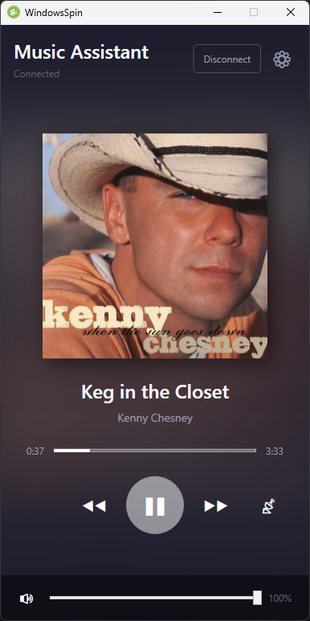

# Sendspin Windows Client

<p align="center">
  
</p>

A Windows WPF client implementation for the [Sendspin protocol](https://www.sendspin-audio.com/), enabling synchronized multi-room audio playback with [Music Assistant](https://music-assistant.io/).

> **⚠️ Disclaimer:** This is an **independent, unofficial project** and is **not affiliated with, endorsed by, or associated with** the Music Assistant project or the official Sendspin protocol maintainers. This is a third-party implementation created for personal use and community benefit.

## Overview

Sendspin Windows Client is a native Windows application that connects to Music Assistant servers to provide synchronized audio playback across multiple devices. It implements the Sendspin protocol, which uses WebSocket communication for control messages and binary audio streaming, combined with NTP-style clock synchronization to achieve precise multi-room audio sync.

This client can operate in two modes:
- **Client Mode**: Actively discovers and connects to Sendspin servers
- **Host Mode**: Advertises itself via mDNS and accepts incoming server connections

## Features

- **Multi-Room Audio Synchronization**: Sub-millisecond audio synchronization using Kalman filter-based clock sync
- **Automatic Server Discovery**: mDNS/DNS-SD discovery of Sendspin servers on the local network
- **Multiple Audio Formats**: Support for PCM, FLAC, and Opus audio codecs
- **Real-time Metadata**: Display of currently playing track information and album artwork
- **Playback Control**: Full playback control (play, pause, volume, next/previous)
- **Dual Operation Modes**:
  - Client-initiated connections (discover and connect to servers)
  - Server-initiated connections (advertise and accept connections)
- **System Tray Integration**: Runs in the background with system tray icon
- **Modern WPF UI**: Clean, responsive user interface using MVVM pattern

## Screenshots

### Main Window
The main interface displays album artwork, track information, and playback controls. Shows connection status to your Music Assistant server.

<p align="center">
  
</p>

### System Tray
Quick access to playback controls without opening the main window. The app runs in the background and can be controlled entirely from the system tray.

<p align="center">
  
</p>

### Manual Connection
For cross-subnet scenarios where mDNS discovery doesn't work, you can manually enter the server's WebSocket URL.

<p align="center">
  
</p>

## Prerequisites

### Runtime Requirements
- Windows 10 version 1809 (build 17763) or later
- .NET 8.0 Runtime or .NET 9.0 Runtime
- Network connectivity to Music Assistant server

### Development Requirements
- Visual Studio 2022 (17.8 or later) or JetBrains Rider
- .NET 8.0 SDK or .NET 9.0 SDK
- Windows 10 SDK (10.0.17763.0)

## Installation

### Option 1: Download Release Binary (Coming Soon)
1. Download the latest release from the [Releases](https://github.com/chrisuthe/windowsSpin/releases) page
2. Extract the archive to your preferred location
3. Run `SendspinClient.exe`

### Option 2: Build from Source
```bash
# Clone the repository
git clone https://github.com/chrisuthe/windowsSpin.git
cd windowsSpin

# Build the solution
dotnet build SendspinClient.sln --configuration Release

# Run the application
dotnet run --project src/SendspinClient/SendspinClient.csproj
```

## Building and Running

### Using Visual Studio
1. Open `SendspinClient.sln` in Visual Studio 2022
2. Select the desired configuration (Debug or Release)
3. Build the solution (F7 or Build > Build Solution)
4. Run the application (F5 for debugging or Ctrl+F5 without debugging)

### Using Command Line
```bash
# Build Debug configuration
dotnet build

# Build Release configuration
dotnet build --configuration Release

# Run the application
dotnet run --project src/SendspinClient/SendspinClient.csproj

# Publish for deployment
dotnet publish src/SendspinClient/SendspinClient.csproj -c Release -r win-x64 --self-contained false
```

### Using Rider
1. Open `SendspinClient.sln` in JetBrains Rider
2. Select run configuration
3. Click Run or Debug

## Architecture

The solution is organized into three projects:

### SendspinClient.Core
Core protocol implementation and business logic. Platform-agnostic .NET 8.0 library.

**Key Components:**
- **Client**: Main client orchestration (`SendspinClientService`, `SendspinHostService`)
- **Connection**: WebSocket connection management (`SendspinConnection`, `SendspinListener`)
- **Discovery**: mDNS server discovery and advertisement (`MdnsServerDiscovery`, `MdnsServiceAdvertiser`)
- **Protocol**: Message serialization and parsing (`MessageSerializer`, `BinaryMessageParser`)
- **Synchronization**: Clock synchronization using Kalman filtering (`KalmanClockSynchronizer`)
- **Audio**: Codec abstraction and decoders (`IAudioDecoder`, `AudioPipeline`)
  - PCM decoder (16/24/32-bit)
  - Opus decoder (via Concentus)
  - FLAC decoder (via SimpleFlac)
- **Models**: Data models for audio format, group state, playback state, and track metadata

### SendspinClient.Services
Windows-specific audio services. Targets .NET 8.0 Windows.

**Components:**
- **Audio Output**: WASAPI-based audio playback via NAudio
- **Audio Buffer Management**: Synchronized sample buffering with server timestamps
- **Platform Integration**: Windows-specific audio device handling

### SendspinClient
WPF desktop application providing the user interface.

**Components:**
- Main window with server list and playback controls
- System tray integration
- MVVM architecture with CommunityToolkit.Mvvm
- Dependency injection with Microsoft.Extensions.DependencyInjection

## Protocol Overview

### Sendspin Protocol Basics

Sendspin is a WebSocket-based protocol for synchronized multi-room audio. It consists of:

1. **Text Messages (JSON)**: Control messages, metadata, and state synchronization
2. **Binary Messages**: Audio data and artwork with microsecond timestamps
3. **Clock Synchronization**: NTP-style time sync for precise audio alignment

### Connection Flow

```
1. Client/Server Discovery (mDNS)
   ├─ Service: _sendspin._tcp.local
   └─ TXT records: id, version, port

2. WebSocket Connection
   ├─ Client connects to ws://server:port/sendspin
   └─ Bidirectional message channel established

3. Handshake
   ├─ Client → Server: client/hello (capabilities, roles, audio formats)
   ├─ Server → Client: server/hello (server info, assigned roles)
   └─ Client → Server: client/state (initial player state)

4. Clock Synchronization
   ├─ Client → Server: client/time (periodic NTP-style sync)
   ├─ Server → Client: server/time (with timestamps)
   └─ Kalman filter processes measurements for offset/drift

5. Streaming
   ├─ Server → Client: stream/start (format, codec)
   ├─ Server → Client: Binary audio chunks (with timestamps)
   ├─ Client buffers and plays audio at synchronized time
   └─ Server → Client: stream/end (when track completes)

6. State Updates
   ├─ Server → Client: group/update (playback, volume, metadata)
   ├─ Server → Client: server/state (full state snapshots)
   └─ Client → Server: client/command (playback control)
```

### Message Types

**Handshake Messages:**
- `client/hello`, `server/hello`: Capability negotiation
- `client/goodbye`: Clean disconnection

**Clock Sync Messages:**
- `client/time`, `server/time`: NTP-style synchronization

**Stream Messages:**
- `stream/start`, `stream/end`, `stream/clear`: Stream lifecycle

**State Messages:**
- `group/update`: Incremental state changes
- `server/state`: Full state snapshots
- `client/state`: Client player state

**Control Messages:**
- `client/command`: Playback commands (play, pause, volume, etc.)

**Binary Messages:**
- Player audio chunks (types 4-7): Timestamped audio data
- Artwork chunks (types 8-11): Album artwork images
- Visualizer data (types 16-23): Audio visualization

### Clock Synchronization

The client uses a Kalman filter-based clock synchronizer to:
- Estimate clock offset between client and server
- Track clock drift over time
- Provide uncertainty estimates for synchronization quality
- Enable sub-millisecond audio alignment across devices

Adaptive sync intervals:
- Initial sync: 200ms intervals (rapid convergence)
- Poor sync (>5ms uncertainty): 200ms
- Moderate sync (2-5ms): 500ms
- Good sync (1-2ms): 1000ms
- Excellent sync (<1ms): 3000ms

## Configuration

The application uses sensible defaults but can be configured:

### Client Capabilities
Edit `ClientCapabilities.cs` to customize:
- Client ID and name
- Supported roles (controller, player, metadata, artwork)
- Audio format preferences
- Buffer capacity

### Code Analysis
The project uses:
- **StyleCop Analyzers**: Code style enforcement
- **Roslynator**: Code quality and refactoring suggestions
- **SonarAnalyzer**: Additional code quality checks

Configuration files:
- `.editorconfig`: Editor and code style settings
- `stylecop.json`: StyleCop-specific settings
- `CodeAnalysis.ruleset`: Analyzer rule configuration

## Contributing

We welcome contributions! Please see [CONTRIBUTING.md](CONTRIBUTING.md) for:
- Development setup instructions
- Code style guidelines
- Pull request process
- Code review expectations

## Troubleshooting

### Common Issues

**Server not discovered:**
- Ensure client and server are on the same network
- Check firewall settings (allow mDNS port 5353, WebSocket ports)
- Verify Music Assistant has Sendspin enabled

**Connection fails:**
- Check server logs for connection errors
- Verify WebSocket endpoint is accessible
- Ensure correct port is configured

**Audio not playing:**
- Verify audio device is configured and working
- Check audio format compatibility
- Review client logs for decoder errors

**Poor synchronization:**
- Check network latency and jitter
- Ensure stable network connection
- Review clock sync status in logs

### Logging

Enable detailed logging by setting environment variables:
```bash
# Set log level to Debug
set Logging__LogLevel__Default=Debug

# Set specific namespace to Trace
set Logging__LogLevel__SendspinClient.Core=Trace
```

Logs include:
- Connection state changes
- Message send/receive (with full JSON)
- Clock synchronization statistics
- Audio buffer status

## Security Considerations

This application is designed for **trusted local networks** (home/office LANs).

### Network Security Model

- **Unencrypted Communication**: WebSocket connections use `ws://` (not `wss://`). Audio data and control messages are transmitted in plain text on your local network.
- **Network Binding**: The host service binds to all network interfaces (`0.0.0.0`) to allow connections from other devices on your network.
- **mDNS Discovery**: Server discovery broadcasts are visible to all devices on the local network segment.

### When to Use This App

| Environment | Recommendation |
|-------------|----------------|
| Home network | ✅ **Safe** - Trusted environment |
| Office LAN | ✅ **Safe** - Controlled network |
| Shared housing (dorms) | ⚠️ **Use caution** - Others can see your client |
| Public WiFi | ❌ **Not recommended** - Untrusted network |
| VPN/tunneled connection | ⚠️ **Consider alternatives** - Latency may affect sync |

### Firewall Configuration

If using Windows Firewall, allow the following:
- **mDNS Discovery**: UDP port 5353 (for automatic server discovery)
- **WebSocket**: TCP port 8927 (default, or the port shown in your Music Assistant settings)

The installer will prompt to add firewall rules automatically.

### Privacy Note

The client broadcasts its name via mDNS, which is visible to other devices on your network. By default, this uses your Windows machine name. A future version will allow configuring a custom display name.

## License

This project is licensed under the MIT License - see the [LICENSE](LICENSE) file for details.

## Acknowledgments

- [Music Assistant](https://music-assistant.io/) - The music streaming and multi-room platform
- [Sendspin Protocol](https://github.com/music-assistant/sendspin) - The synchronization protocol specification
- [NAudio](https://github.com/naudio/NAudio) - Audio library for Windows (WASAPI playback)
- [Concentus](https://github.com/lostromb/concentus) - Pure C# Opus decoder
- [SimpleFlac](https://github.com/jdpurcell/SimpleFlac) - Pure C# FLAC decoder (vendored)
- [Zeroconf](https://github.com/novotnyllc/Zeroconf) - mDNS/DNS-SD library

## Related Projects

- [Music Assistant](https://github.com/music-assistant/server) - Server implementation
- [Sendspin CLI](https://github.com/music-assistant/sendspin-cli) - Official CLI reference client
- [aiosendspin](https://github.com/music-assistant/aiosendspin) - Python client library

## Support

For issues, questions, or feature requests **specific to this Windows client**:
- Open an issue on [GitHub Issues](https://github.com/chrisuthe/windowsSpin/issues)

For general Music Assistant questions (not related to this client):
- Join the [Music Assistant Discord](https://discord.gg/musicassistant)
- Check the [Music Assistant documentation](https://music-assistant.io/documentation/)

*Note: Please do not contact the Music Assistant team for support with this unofficial client.*
