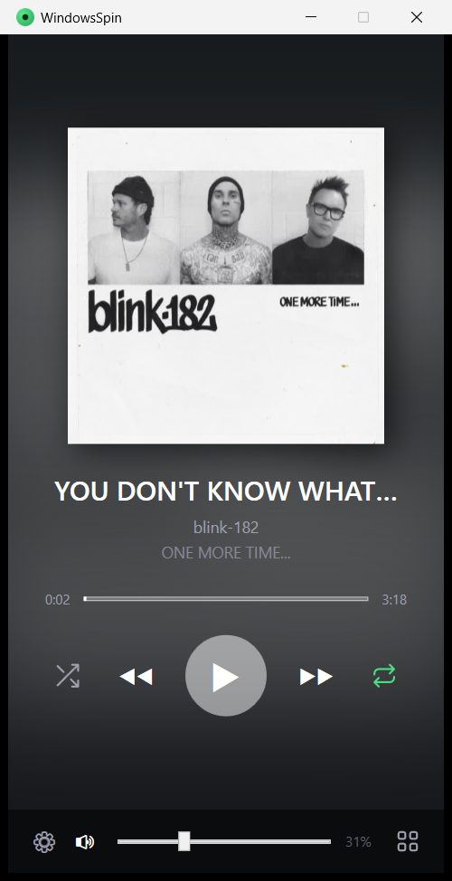
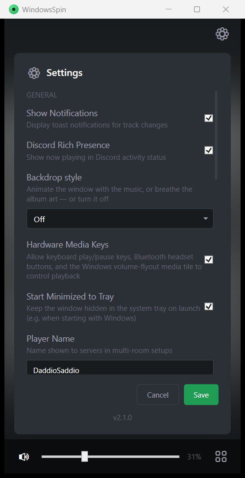

# WindowsSpin - Multi-Room Audio for Windows

  

**Turn any Windows PC into a synchronized multi-room audio player.**

WindowsSpin connects your Windows computer to [Music Assistant](https://music-assistant.io/), allowing you to play music throughout your home in perfect sync. Whether you have an old laptop, a home theater PC, or a desktop workstation, WindowsSpin transforms it into part of your whole-home audio system.

> **Disclaimer:** This is an **independent, unofficial project** and is **not affiliated with, endorsed by, or associated with** the Music Assistant project or the official Sendspin protocol maintainers.

---

## Download & Install

### Requirements
- Windows 10 version 1809 or later
- [.NET 10.0 Runtime](https://dotnet.microsoft.com/download/dotnet/10.0) (or use the self-contained installer)

### Installation

1. Download the latest installer from the [Releases page](https://github.com/chrisuthe/windowsSpin/releases)
2. Run the installer
3. Launch WindowsSpin from the Start Menu

**Options:**
- `WindowsSpin-Setup.exe` — Standard installer (requires .NET 10 runtime)
- `WindowsSpin-Setup-SelfContained.exe` — Includes runtime (larger download, no dependencies)
- `WindowsSpin-portable.zip` — Portable version, no installation needed

---

## Getting Started

### 1. Connect
WindowsSpin automatically discovers Music Assistant servers on your network. If your server isn't found, enter the address manually (e.g., `10.0.2.8:8927`).

### 2. Play
Your Windows PC now appears as a player in Music Assistant. Add it to a group with other players for synchronized multi-room playback.

That's it!

---

## Screenshots

  
  &nbsp;&nbsp;
  

---

## Troubleshooting

**Server not discovered?**
- Ensure client and server are on the same network
- Check firewall settings—allow mDNS (UDP 5353) and WebSocket (TCP 8927)
- Try entering the server address manually

**Audio not playing?**
- Verify your audio device is working in Windows
- Check Settings → Audio Device in WindowsSpin

**Poor synchronization?**
- Check your network connection stability
- Open Settings → Stats for Nerds to see sync status

For more help, see the [Wiki](https://github.com/chrisuthe/windowsSpin/wiki) or open an [issue](https://github.com/chrisuthe/windowsSpin/issues).

---

## For Developers

Want to contribute or build from source? See the **[Developer Documentation](https://github.com/chrisuthe/windowsSpin/wiki)** on our Wiki.

---

## Related Projects

- [Music Assistant](https://music-assistant.io/) — The music streaming platform
- [Sendspin CLI](https://github.com/music-assistant/sendspin-cli) — Official CLI reference client

---

## License

MIT License — see [LICENSE](LICENSE) for details.

## Acknowledgments

- [Music Assistant](https://music-assistant.io/) — The music streaming and multi-room platform
- [Sendspin Protocol](https://github.com/music-assistant/sendspin) — The synchronization protocol
- [NAudio](https://github.com/naudio/NAudio), [Concentus](https://github.com/lostromb/concentus), [Zeroconf](https://github.com/novotnyllc/Zeroconf) — Core libraries
